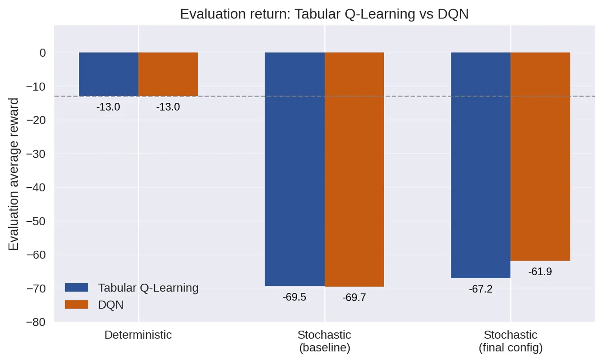
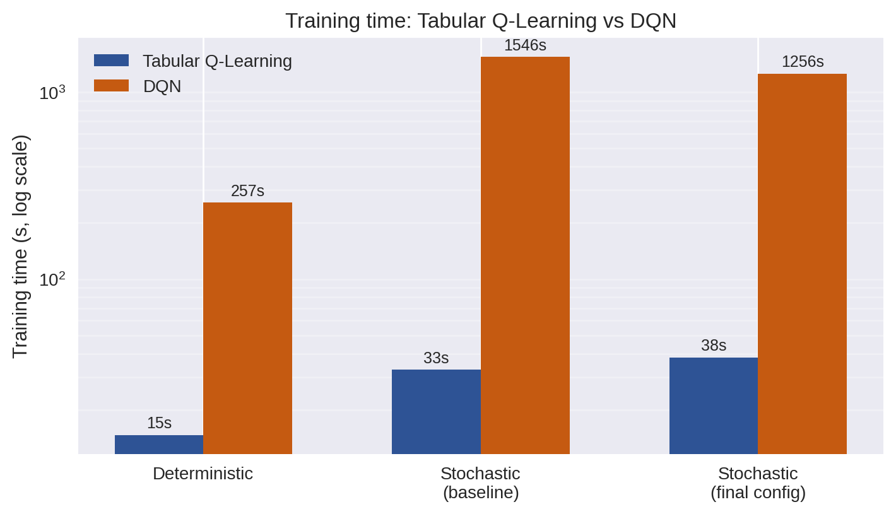

# Reinforcement Learning on CliffWalking: Tabular Q-Learning vs. DQN

**Two reinforcement-learning agents implemented from scratch**, a **tabular Q-learning** agent and a **Deep Q-Network** in PyTorch, trained on Gymnasium's **CliffWalking-v1** with a slippery (stochastic) floor, and compared across **30+ controlled experiments**.

Individual project for the *Machine Learning* course, Master of Science in Engineering in Computer Science, Sapienza University of Rome.

📄 [Full report (PDF, 25 pages)](ML_RL_Report.pdf)



---

## The problem

A 4×12 gridworld: the agent starts bottom-left and must reach the goal bottom-right, walking along a **cliff**. Each step costs −1 and falling costs −100 and sends the agent back to the start. With `is_slippery=True` the agent sometimes moves in an unintended direction, so the **safe path away from the edge** becomes more valuable than the shortest one.


## What I built

**Tabular Q-learning** (`src/tabular_q_learning.py`)
- Q-table updated with the **non-deterministic Bellman update**
- ε-greedy exploration with a configurable decay schedule

**Deep Q-Network** (`src/dqn_cliffwalking.py`)
- PyTorch MLP on one-hot state encodings
- **Experience replay buffer**
- A **single Q-network**, as required by the project, with no separate target network. The bootstrap target is computed under `torch.no_grad()`, so gradients flow only through the prediction
- Minibatch training with configurable batch size, buffer size and hidden units

**Shared experiment infrastructure**
- Every run is defined by a `Config` dataclass and saved in its own timestamped folder, with the trained model (`q_table.pkl` / `dqn_model.pt`), training curves and a `results.txt`
- Results are appended to a `summary.csv` per agent, which makes comparisons reproducible
- Separate **greedy-policy evaluation** over 100 episodes

## Methodology

1. **Validate in the deterministic environment**: both agents must recover the theoretical optimum (**−13**, the shortest path).
2. **Stochastic baseline**.
3. **One-at-a-time hyperparameter isolation**: learning rate, discount factor γ, ε-decay, number of episodes, and for DQN also batch size, replay-buffer size and network width.
4. **Combined configurations** and selection of the final setup for each agent.
5. **Head-to-head comparison**: return, training time, stability and failure modes, sample efficiency.

## Results

| Configuration | Tabular (eval return / success) | DQN (eval return / success) | Tabular time | DQN time |
|---|---|---|---:|---:|
| Deterministic | −13.00 / 100% | −13.00 / 100% | 14.7 s | 256.9 s |
| Stochastic, baseline | −69.45 / 100% | −69.65 / 100% | 32.8 s | 1545.7 s |
| Stochastic, **final** | **−67.16 / 100%** | **−61.90 / 100%** | 38.1 s | 1256.3 s |
| Worst run observed | −90.36 / 99% (α = 0.9) | −2058.34 / 85% (buffer = 256) | 45.5 s | 49.9 s |

**Key findings**
- **Both implementations are correct**: both reach the exact optimum −13 in the deterministic setting.
- **Similar final performance** in the stochastic setting: DQN is slightly better (−61.9 vs. −67.2), with 100% success for both.
- **DQN is 17–40× slower to train**. With only 48 states, the network's extra cost does not pay off.
- **Failure modes differ**: bad tabular hyperparameters degrade performance gradually, while DQN can fail completely. With a replay buffer of 256 the network never received a gradient update and the return was over 30× worse. Function approximation adds moving parts that must be configured correctly.



## Getting started

Requirements: **Python 3.10+**.

```bash
pip install -r requirements.txt
cd src
python tabular_q_learning.py     # final tabular configuration (about 40 s)
python dqn_cliffwalking.py       # DQN stochastic baseline (about 20–25 min on CPU)
```

Hyperparameters are set in the `Config(...)` block at the bottom of each script. Each run creates a new folder in `src/Q_table/` or `src/DQN/` and adds a row to that folder's `summary.csv`.

## Repository structure

```
src/
├── tabular_q_learning.py   # tabular agent, training, evaluation, plots
├── dqn_cliffwalking.py     # DQN agent (PyTorch), replay buffer
├── Q_table/                # all tabular runs: q_table.pkl, plots, results.txt, summary.csv
└── DQN/                    # all DQN runs: dqn_model.pt, loss/metric plots, results.txt, summary.csv
docs/images/                # figures used in this README
ML_RL_Report.pdf            # full report: theory, experiments, analysis
```

## Author

**Bogdan Andrei Tutuianu** – [GitHub](https://github.com/bogX2)
